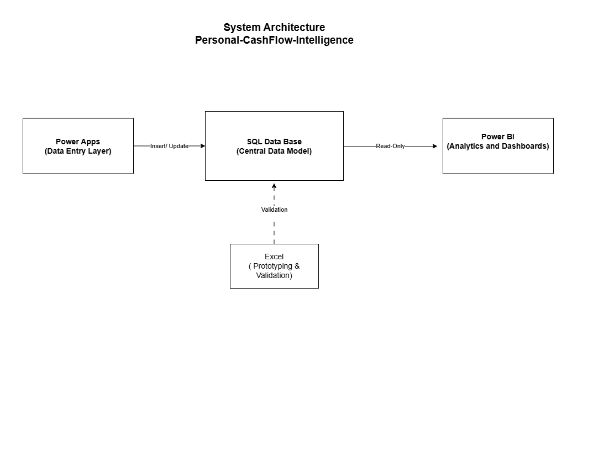
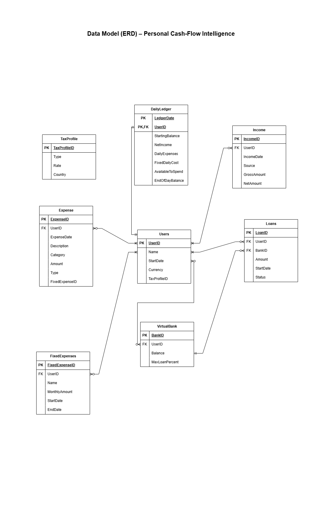

# personal-cashflow-intelligence
## Overview
this project is an end-to-end financial intelligence system designed to track daily income, expences, and real time spending capacity.
The system models real-world financial concepts such as:
- Daily net income
- Fixed expence proration
- Cash-flow forcasting
- Virtual internal banking

 ---
 ## Problem Statement
 Most budgeting tools focus on monthly summaries and fail to answer a critical 
 daily question:
 **"Can I spend more today or not?"**
 This system solves that problem using daily accural-based logic.

 ---
 ## Architecture
 Power Apps → SQL Database → Power BI  
 Excel is used for prototyping and validation.
 

 ---
 ## Data Model
 

 ---
 ## Tools Used
 - SQL
 - Power BI
 - Excel
 - Power Apps

 ---
 ## Project Status
 In progress

 
